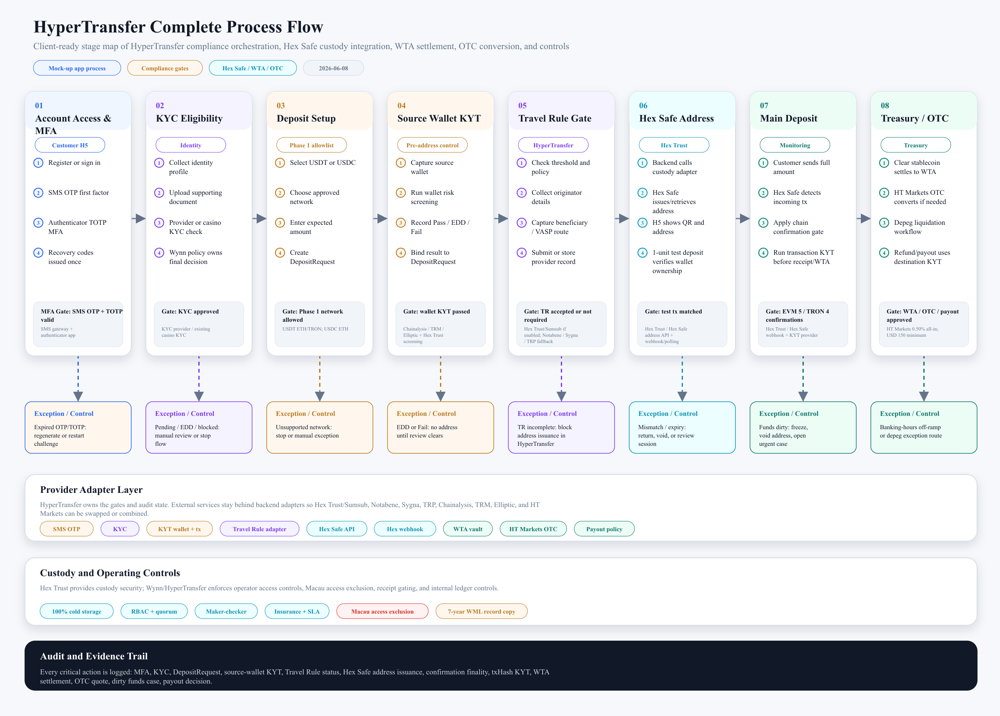

# HyperTransfer Complete Process Flow

> Prepared for client discussion
> Date: 2026-06-08
> Scope: complete process happening inside the current mock-up app and its intended orchestration layer
> Source references: `hypertransfer-main/client/src/App.tsx`, `hypertransfer-main/backend/server.py`, `src/domain/state-machine.ts`, `ProjectInfo/design.md`

## Executive Summary

This process flow shows the complete HyperTransfer journey from user onboarding through account security, KYC, deposit setup, source-wallet KYT screening, Travel Rule handling, Hex Safe custody address issuance, wallet-ownership verification, main deposit monitoring, transaction-level KYT, WTA settlement, HT Markets OTC conversion, refund/payout handling, and operating controls.

The diagram is organized as a professional stage-gate flow so a client can see both the customer-facing mock-up journey and the compliance/custody processes that happen behind it. HyperTransfer / WML owns the orchestration gates and audit state; Hex Trust / Hex Safe provides custody, API, webhook, security, and control capabilities.

## Diagram Files

- PNG for sharing in chat or inserting into slides: [`2026-06-08-HyperTransfer-Complete-Process-Flow.png`](./2026-06-08-HyperTransfer-Complete-Process-Flow.png)
- SVG for sharper presentation/export: [`2026-06-08-HyperTransfer-Complete-Process-Flow.svg`](./2026-06-08-HyperTransfer-Complete-Process-Flow.svg)
- Editable vector source: [`2026-06-08-HyperTransfer-Complete-Process-Flow.svg`](./2026-06-08-HyperTransfer-Complete-Process-Flow.svg)



## Stage Breakdown

| Stage | What happens |
|---|---|
| 1. Account Access and MFA | New users register with SMS OTP, bind authenticator-based TOTP, and receive recovery codes. Returning users log in through password + TOTP/recovery-code verification. |
| 2. KYC and Customer Eligibility | Customer identity data is collected, checked by a KYC provider or existing casino KYC system, and finalized by Wynn policy. Pending/EDD and blocked paths are shown explicitly. |
| 3. Deposit Setup | The customer selects a Phase 1 supported asset/network, enters the expected amount, and the backend creates a DepositRequest. Phase 1 should default to USDT on ERC-20/TRC-20 and USDC on ERC-20. BTC and ETH assets are excluded. |
| 4. Source Wallet KYT | The customer enters the source wallet and HyperTransfer screens it before address issuance. EDD/Fail paths do not receive a deposit address until manual review clears. |
| 5. Travel Rule Gate | HyperTransfer / WML collects and gates Travel Rule data before address issuance when required by threshold, policy, or jurisdiction. Provider options include Hex Trust/Sumsub if contractually enabled, or Notabene/Sygna/TRP. |
| 6. Hex Safe Address and Wallet Ownership Verification | The backend requests or retrieves a Hex Safe deposit address through the custody adapter and the customer sends a 1-unit verification deposit to prove wallet ownership and session match. |
| 7. Main Deposit, Confirmation and Transaction KYT | The actual incoming txHash is matched, the Hex Safe confirmation gate is applied, and transaction-level KYT clears funds before receipt/WTA processing. EVM chains are 5 confirmations and Tron is 4 confirmations under the Hex Trust response. |
| 8. Treasury / OTC and Payout Path | Clear stablecoins settle to WTA. HT Markets OTC conversion, depeg liquidation, refund, and payout flows are handled as treasury-controlled workflows with destination-wallet KYT and approval controls. |

## Key Compliance Gates

1. **Account security gate**: SMS OTP + password + authenticator TOTP/recovery-code MFA.
2. **KYC gate**: customer must have an approved KYC status before deposit activity proceeds.
3. **Phase 1 network gate**: supported production defaults should be USDT on ERC-20/TRC-20 and USDC on ERC-20. BTC and ETH assets are not processed in Phase 1.
4. **Pre-deposit KYT gate**: source wallet must pass screening; EDD and Fail paths do not auto-proceed.
5. **Travel Rule gate**: HyperTransfer / WML enforces the gate before address issuance. Hex Trust/Sumsub may be used if contractually enabled; otherwise a third-party provider such as Notabene/Sygna/TRP should be used.
6. **Wallet ownership gate**: a 1-unit verification deposit confirms that the source wallet and session address match.
7. **Confirmation gate**: Hex Trust confirmation thresholds are chain-defined, not Wynn-customized; EVM chains use 5 confirmations and Tron uses 4 confirmations.
8. **Transaction KYT gate**: the real incoming txHash is screened after funds arrive; pre-deposit wallet KYT does not replace transaction-level screening.
9. **Treasury settlement / OTC gate**: clear USDC/USDT funds settle to WTA, while conversion or depeg liquidation goes through HT Markets OTC and treasury approval.
10. **Refund / payout gate**: refunds/payouts require authenticated destination-wallet collection, destination-wallet KYT, treasury/compliance approval, policy checks, custody signing, broadcast, webhook completion, reconciliation, and audit evidence.

## Refund Process Update

Refund is treated as a payout / withdrawal workflow rather than a simple reversal. HyperTransfer should not blindly return funds to the original source address, because exchange or pooled-wallet source addresses may not map cleanly back to the customer. The customer must confirm a refund destination wallet through an authenticated one-time flow, and the destination must be validated and screened before treasury approval.

Recommended refund sequence:

```text
Customer/support opens refund request
-> Link to original DepositRequest / txHash
-> Confirm Phase 1 stablecoin asset/network
-> Customer submits refund destination wallet
-> Validate ERC-20/TRC-20 format
-> Run destination-wallet KYT
-> Pass / manual review / reject
-> Treasury + compliance approval
-> Hex Safe custody transfer / signing / broadcast
-> Webhook or polling confirms completion
-> Record txHash, reconcile, notify customer, close case
```

## Notes for Client Conversation

- The mock-up demonstrates the product and compliance journey; real funds movement, custody signing, KYT provider calls, and Travel Rule provider calls are represented through adapters or demo logic.
- Use `Hex Trust` when referring to the custody provider/company. Use `Hex Safe` when referring to the platform/API surface used for address issuance, webhook monitoring, policy controls, and signed withdrawals.
- Under the Hex Trust clarification response, built-in Travel Rule capability exists through Sumsub, but it is not currently enforced at the platform layer for WML's Hong Kong Hex Trust Limited contracting setup. HyperTransfer should therefore keep the Travel Rule gate and provider adapter under WML control.
- HT Markets OTC conversion is separately available for stablecoin on/off-ramp. The clarification response states a 0.50% all-in fee and USD 150 minimum fee for USDT/USDC to USD or USD to USDT/USDC trades.
- Macau access exclusion means Macau-based staff/devices/networks should not operate the VA platform. Hex Trust does not enforce this on Wynn's behalf, so it belongs in Wynn / HyperTransfer IAM, device, network, and operator-provisioning controls.
- `WTA` means Wynn Treasury Account / treasury vault structure, not a single exposed deposit address.
- `Source Wallet Address` is the customer's sending wallet. It is different from the receiving address issued by Hex Trust.
- Production implementation should keep KYC, KYT, Travel Rule, address issuance, transaction monitoring, settlement, payout, and audit logging behind backend provider adapters.
