# HyperTransfer 演示走查（配图版）

> 截图取自**本地全量演示**（`localhost:3000`，2026-06-29）。每张图配【这是哪一页】+【演示时讲什么】。
> 文字版分步脚本见同目录 `HyperTransfer-Demo-Script.md`；本文件是它的"配图速览"。
> 真实/demo 边界：KYC=Sumsub 真实；来源钱包 KYT / Travel Rule / Forex / Marker = demo 占位（结构已对接真实，待外部依赖）。

---

## 准备 · 登录

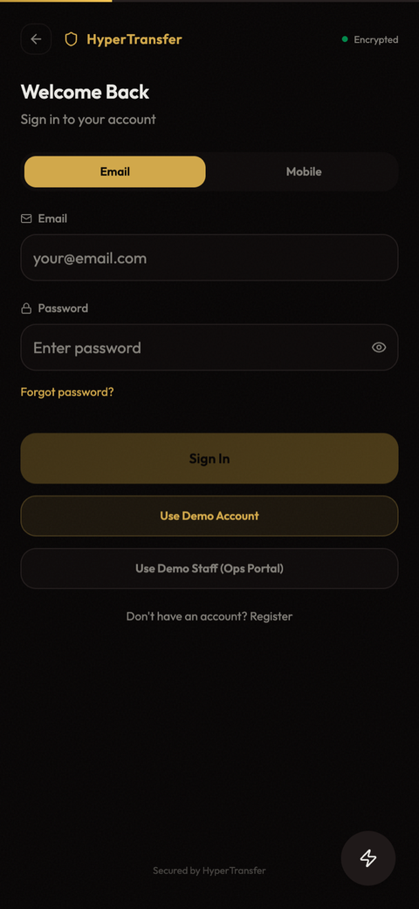

- 客户：`patron.demo@hypercrypto.com` / `Patron@Demo123`（2FA 关，直接进）
- 员工：`admin@demo.local` / `Staff@Demo123` + 6 位 TOTP（`./backend/.venv/bin/python backend/seed_demo.py code`）

---

## 流程一 · 准入 + 开户（ACCESS + ACCOUNT）

**后台：邀请审核**（员工 `/casino-ops`）—— RM 提交 → Marketing 批准 → 签发 single-use+72h 链接。

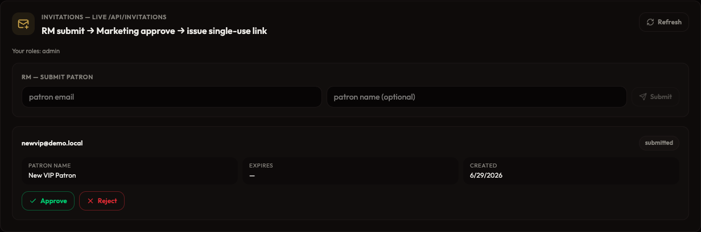

> 讲："准入是**邀请制**，不是公开注册。客户经理提交 → 市场/合规复核 → 系统签发一次性 72 小时链接发到客户邮箱。"

**客户：KYC（Sumsub，6 个月有效）→ hold→active 解锁入金**

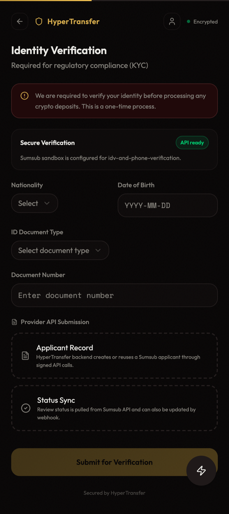
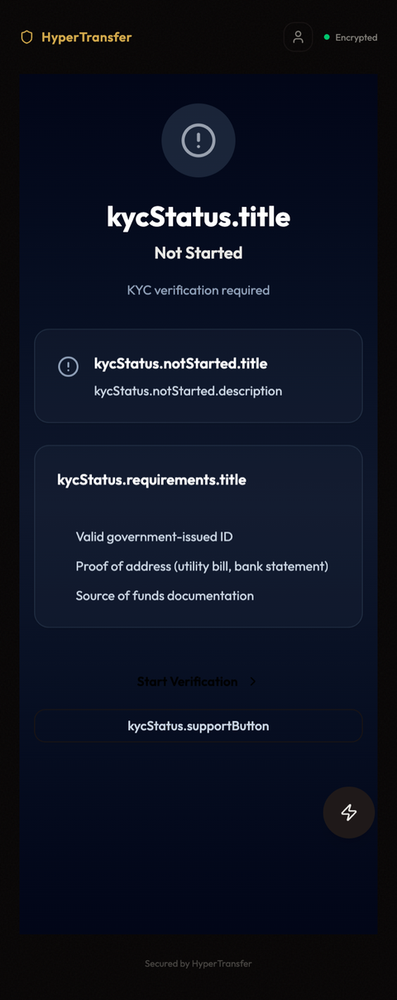

> 讲："KYC 走 Sumsub；未过/过期账户处于 **hold**，发地址/入金/退款被**硬阻断**。"

**客户仪表盘**（KYC 通过后入金入口才点得动）

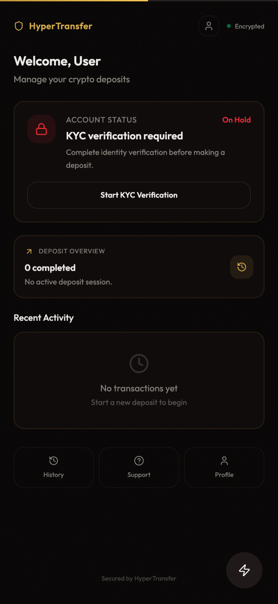

---

## 流程二 · 入金 + 结算（DEPOSIT + SETTLEMENT）

**1. 新建入金** —— 仅 USDT；填到 ≥USD 1,000 自动提示 **Travel Rule**。

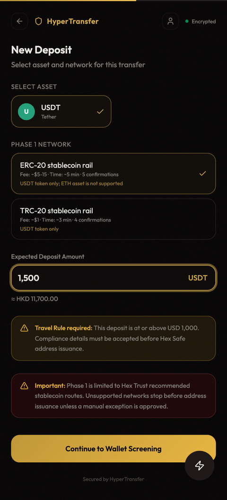

**2. 来源钱包筛查（KYT）** —— 发地址前先筛客户来源钱包。

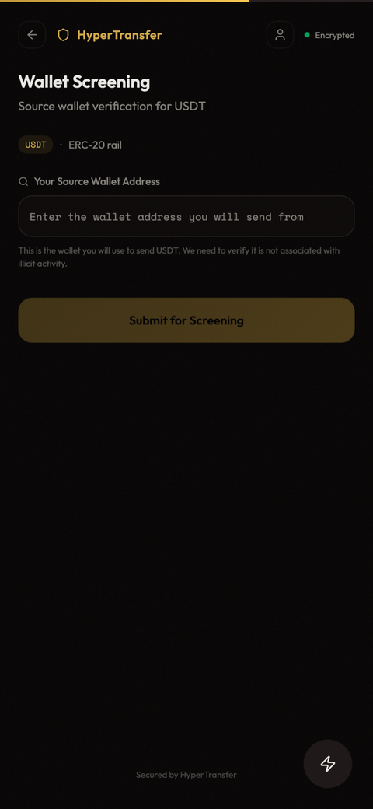
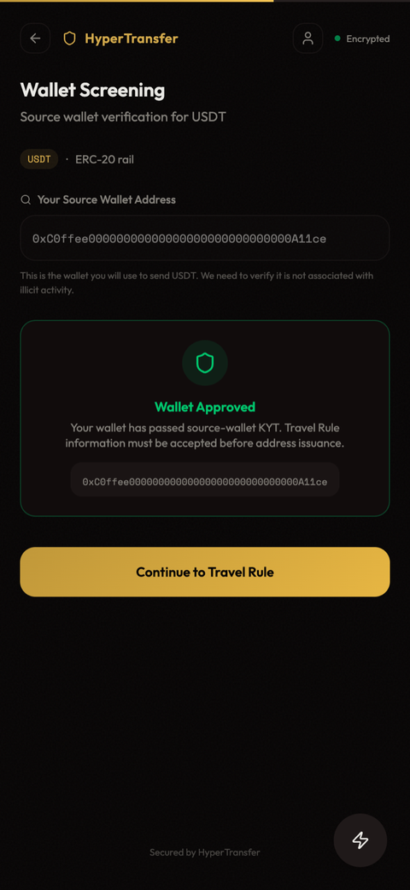

**3. Travel Rule**（≥USD1k 触发，收集 FATF 发起方信息）

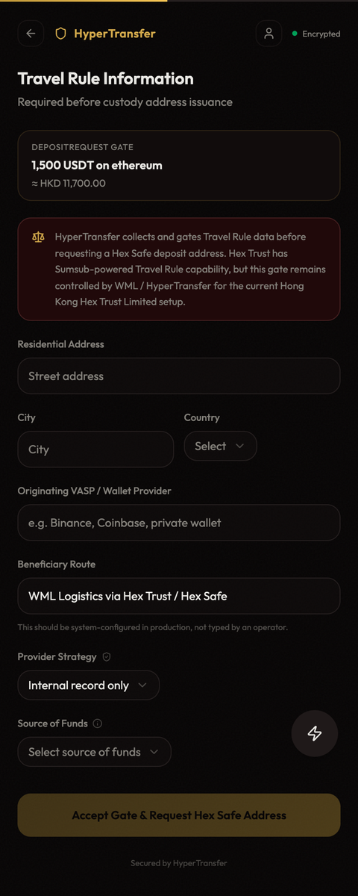

**4. 发收款地址** —— **三道合规闸门（KYC + 钱包 KYT + Travel Rule）全绿才发址**；先打 **1 USDT** 验证钱包控制权。

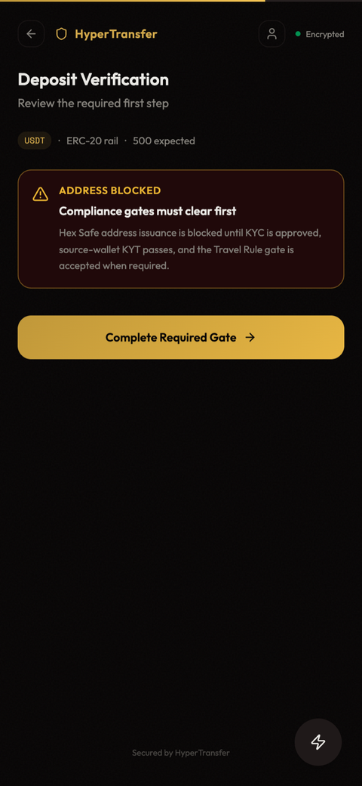

> 讲："只有三道闸门全过才发地址；先 1 USDT 小额验证——**这步把这个钱包记成客户的'已验证原钱包'，退款只能退回这里**。"

**后台：入金队列 + Marker + 结算**（员工）

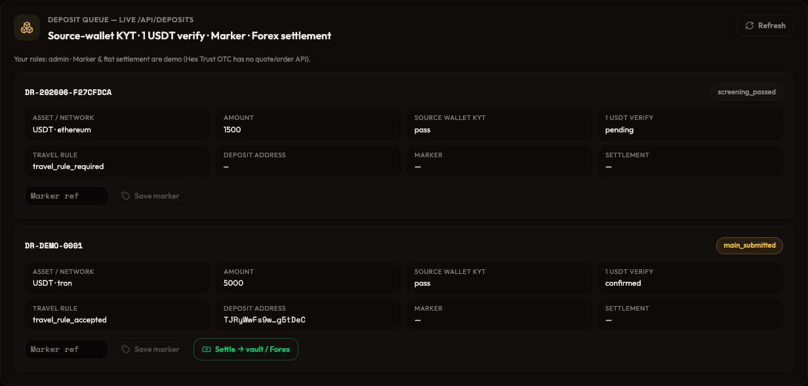

> 讲："运营在后台看每笔入金的合规状态；国际市场部录回外部 **Marker** 编号；托管确认后 settle（兑法币、出回执）。Marker/Forex 为 demo（Hex Trust OTC 无 API）。"

---

## 流程三 · 退款（RETURN）—— 合规红线

**客户：发起退款 → 只能选"已验证原钱包"**

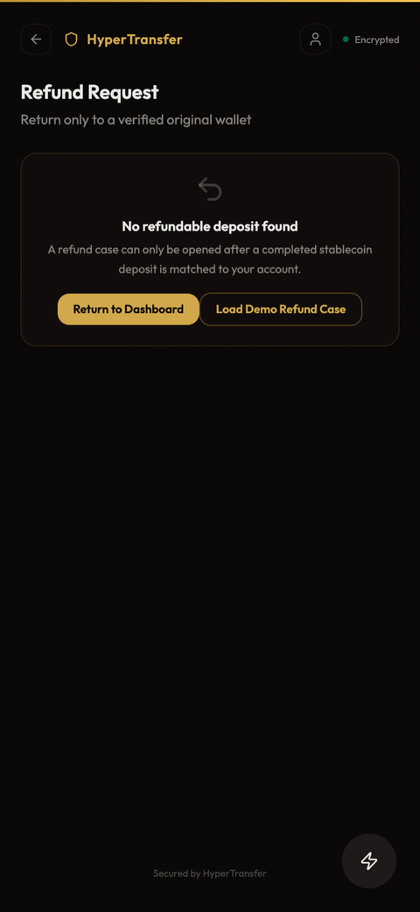
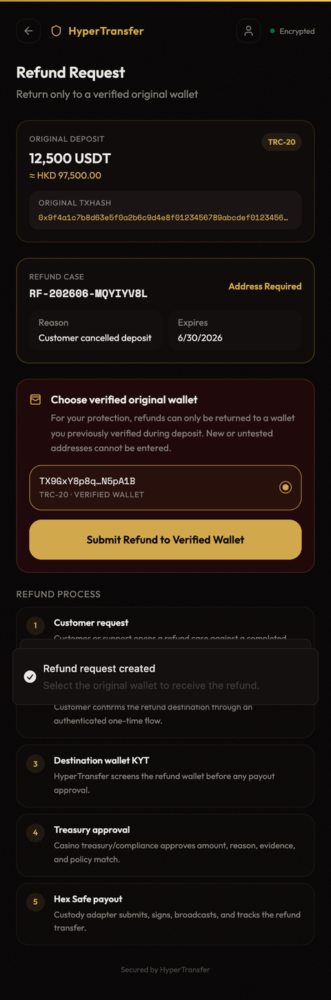

> 讲（重点）："退款**只能退回客户入金时验证过的原钱包**，界面上**根本没有输入新地址的框**。后端还会再校验钱包确属本人，否则拒。"

**后台：退款审批闭环**（分权：compliance → management → custodian）

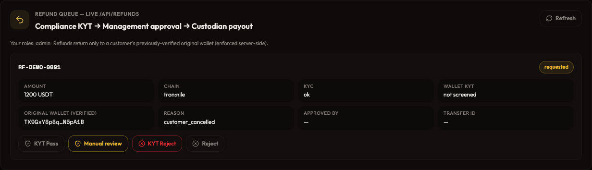

> 讲："退款是**人工分权闭环**——合规先重新 KYT 原钱包，管理层审批，托管执行放款；每步角色守卫 + 审计留痕，Transfer ID 关联 Request ID。"

---

## 后台总览（`/casino-ops`）

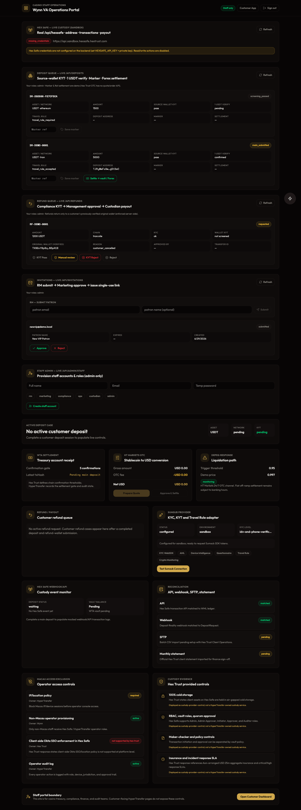

**真实 Hex Safe 托管面板**（配凭据时真实发址/到账/提现）

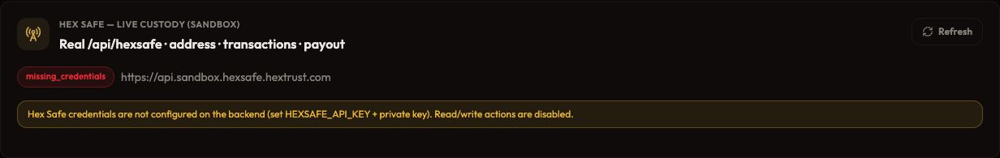

**员工账号管理**（admin 开户 + 分配角色 + 出 TOTP 二维码）

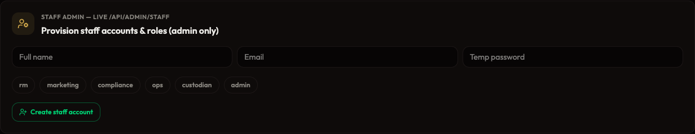

---

## 演示亮点速记（一句话版）

1. **邀请制准入** — 一次性 72h 链接绑邮箱。
2. **KYC=Sumsub + 6 个月 + 硬阻断**。
3. **入金三闸门** — KYC + 钱包 KYT + Travel Rule 全绿才发址。
4. **1 USDT 验证** + 据此锁定"可退回原钱包"。
5. **退款只退原钱包（红线）** — 无新地址输入框 + 后端归属校验。
6. **退款人工分权审批** — 合规→管理层→托管，全程留痕。
7. **RBAC 5 角色** — 前端显隐 + 后端 `require_role` 真守卫。

> 注：截图未含 `/main-deposit`（1 USDT 发送页）与 `/deposit-success`（结算摘要）——演示时现场点一下即见；其余每页均已配图。
