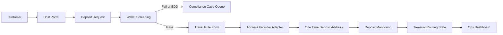

# VirtualAsset 项目实施计划

## 资料理解

参考材料显示，这个项目不是普通钱包工具，而是一个面向运营方虚拟资产入金/出金场景的合规编排系统。

主要依据：

- [`/Users/easonchen/Documents/Code/VirtualAsset/ProjectInfo`](/Users/easonchen/Documents/Code/VirtualAsset/ProjectInfo)：截图资料强调 HT 平台能力、Okta/RBAC、KYC/KYT、Travel Rule、持续交易监控、出金前再筛查、多签审批和合规阻塞项。
- [`/Users/easonchen/Documents/Code/VirtualAsset/ProjectReference/Crypto Deposits Vision.pdf`](/Users/easonchen/Documents/Code/VirtualAsset/ProjectReference/Crypto%20Deposits%20Vision.pdf)：描述 5 个阶段：Deposit、On-chain Analysis、Prime Broker、WTA、Payouts。
- [`/Users/easonchen/Documents/Code/VirtualAsset/ProjectReference/Project - C (1).pdf`](/Users/easonchen/Documents/Code/VirtualAsset/ProjectReference/Project%20-%20C%20(1).pdf)：当前读取结果主要是图片/二进制流，无法可靠抽取正文；实施前建议如有需要再做 OCR。

## 建议目标

第一版先做一个 **Internal Web MVP**，目标是让业务和合规团队能完整演示并验证：

- Host/Account Manager 创建或选择客户。
- 客户提交外部钱包地址、币种、网络、金额。
- 系统执行钱包风险筛查。
- 通过后收集 Travel Rule 信息。
- 系统生成单次收款地址或链接。
- 入金进入待监听/已到账/合规通过/异常处理状态。
- 运营后台可看案件、风险结果、审计日志和手动处理入口。

暂不在第一版直接接真实资金流、真实托管签名或真实链上转账；这些通过 Provider Adapter 和 mock 数据先固定接口。

## 技术路线

沿用当前已初始化的 TypeScript 项目，但建议升级为全栈应用结构：

- 前端：Next.js 或 Vite React，优先 Next.js 如果要同时做 API routes 和后台页面。
- 后端：TypeScript 服务层，先以本地 API/mock provider 实现业务状态机。
- 数据库：Prisma + SQLite 起步，后续可切 PostgreSQL。
- UI：先复刻资料里的深色 Operator 风格关键页面，不追求完整设计系统。
- 集成方式：所有外部能力做 Adapter 接口，第一版使用 mock 实现。

核心模块：

- `Customer`：客户、KYC 状态、外部系统 ID、风险标记。
- `DepositRequest`：币种、网络、金额、状态、Host、客户、地址。
- `WalletScreening`：风险分、制裁命中、跳数、污染比例、结论。
- `TravelRuleSubmission`：发起方/受益方信息、阈值判断、提交状态。
- `DepositAddress`：单次地址、Provider、过期时间、是否作废。
- `ComplianceCase`：EDD、失败、脏款、人工复核、关闭原因。
- `AuditLog`：所有关键动作留痕。

## 实施顺序

1. **需求落地与骨架调整**
   - 整理业务状态机和页面清单。
   - 将当前 Node TypeScript 项目调整为可运行 Web MVP。
   - 加入数据库 schema、seed 数据和基础布局。

2. **核心入金流程**
   - 实现 Host 创建 Deposit Request。
   - 实现钱包地址筛查 mock：Pass、Fail、EDD 三种结果。
   - 实现 Travel Rule 表单和提交校验。
   - 实现发址成功页，支持复制地址。

3. **运营后台**
   - Deposit 列表、状态筛选、详情页。
   - Compliance Case 队列。
   - 手动标记复核通过/失败/关闭。
   - 审计日志展示。

4. **Provider Adapter 层**
   - 定义 `ScreeningProvider`、`TravelRuleProvider`、`AddressProvider`、`ChainMonitorProvider` 接口。
   - mock 实现先驱动 UI 和状态机。
   - 后续替换成 HT、Chainalysis/TRM/Elliptic、Notabene/Sygna/TRP 等真实服务。

5. **验证与演示**
   - 增加最小测试：状态机、表单校验、Provider mock。
   - 准备 seed 场景：低风险通过、高风险失败、EDD 人工复核、Travel Rule 缺失。
   - 跑通 `npm run build` / `typecheck`。

## 第一版范围边界

第一版包含：客户/Host 入金流程、钱包筛查、Travel Rule、发址、状态追踪、案件队列、审计日志、mock provider。

第一版不包含：真实资金转移、真实托管签名、多签移动审批、真实 Okta SSO、真实链上监听、真实 STR/HKFIO 报送、Prime Broker 报价交易、WTA 实际清算。

这些能力需要在业务、法务、合规和供应商选型明确后再进入第二阶段。
