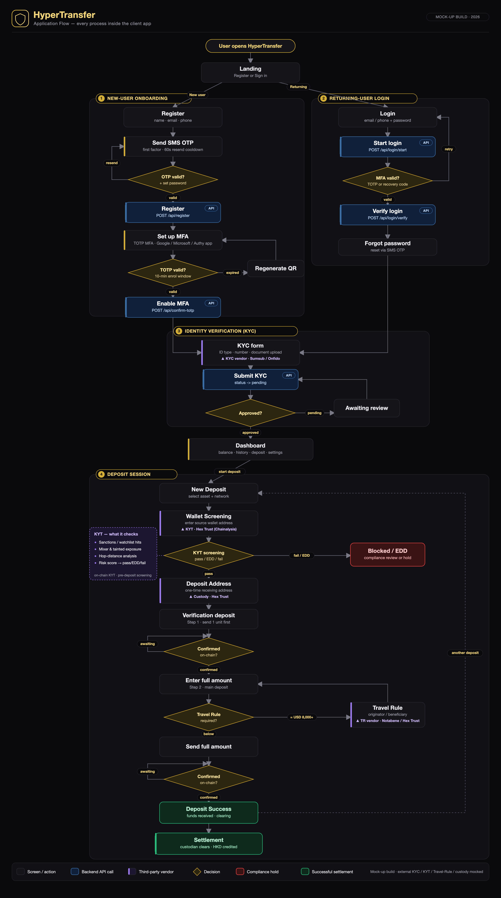

# HyperTransfer — Application Flow

A single, branded end-to-end view of every process inside the HyperTransfer client app (H5),
from first registration through a fully settled deposit.

| Asset | File | Use |
|---|---|---|
| Vector | [`app-flow.svg`](./app-flow.svg) | Scales infinitely — embed in docs / decks, print crisp |
| Raster | [`app-flow.png`](./app-flow.png) | 3360×6020 (2×) — drop into email / slides |
| Source | [`gen_flow.py`](./gen_flow.py) | Regenerates the SVG (hand-laid-out, not auto-generated) |



## The four stages

1. **New-user Onboarding** — Register (name / email / phone) → real SMS OTP (first factor,
   60s resend cooldown) → bind **TOTP MFA** via any standard authenticator app (Google
   Authenticator, Microsoft Authenticator, Authy, 1Password…), second factor, 10-min
   enrolment window; regenerate the QR if it expires.
2. **Returning-user Login** — Two-step: email/phone + password issues a challenge, then an
   **MFA** code (TOTP or one-time recovery code) completes it and a session token is issued.
   "Forgot password" resets via SMS OTP.
3. **Identity Verification (KYC)** — Submit ID details + document; status starts `pending`
   and must reach `approved` before the user can transact.
4. **Deposit Session** — Select asset + network → pre-deposit **KYT** screening of the
   source wallet → one-time receiving address → **send a 1-unit verification deposit first**,
   then the full amount → **Travel Rule** details collected when the amount is **≥ USD 8,000**
   → on-chain confirmation → custodian clears the funds and the HKD equivalent is credited.

   **KYT — what the screening checks:** sanctions / watchlist hits · mixer & tainted-fund
   exposure · hop-distance (graph) analysis · risk score → **pass / EDD / fail**.

## Third-party services (vendor-provided — marked with a violet bar in the diagram)

These steps are not built in-house; they are delivered by external providers. The app
orchestrates them through adapters (mocked in this build).

| Step | Provider (examples) |
|---|---|
| KYC identity verification | Sumsub · Onfido |
| Wallet screening (KYT) | **Hex Trust** (Hex Safe) — Chainalysis KYT engine integrated |
| Travel Rule | Notabene · Sygna / Hex Trust |
| Address issuance · custody · on-chain monitoring | **Hex Trust** (Hex Safe) |
| SMS OTP | Hypervelocity gateway |

## Legend

| Mark | Meaning |
|---|---|
| Rounded card | Screen / user action |
| Blue card with **API** tag | Backend API call (`/api/...`) |
| **Violet left bar** | Third-party vendor service |
| Amber diamond | Decision / branch |
| Red card | Compliance hold (fail / EDD) |
| Green card | Successful settlement |

## Regenerate

The diagram is produced by a small Python generator (precise grid layout) and rasterised
with headless Chrome — no external services.

```bash
cd hypertransfer-main/docs
python3 gen_flow.py                      # writes app-flow.svg
# rasterise to 2x PNG (any headless Chromium works):
chrome --headless --force-device-scale-factor=2 \
       --window-size=1680,3010 --screenshot=app-flow.png app-flow.svg
```

> This reflects the **mock-up** flow. Real-money custody, on-chain transfers, KYT, and the
> SMS / Travel-Rule providers are mocked or in demo configuration in this build.
